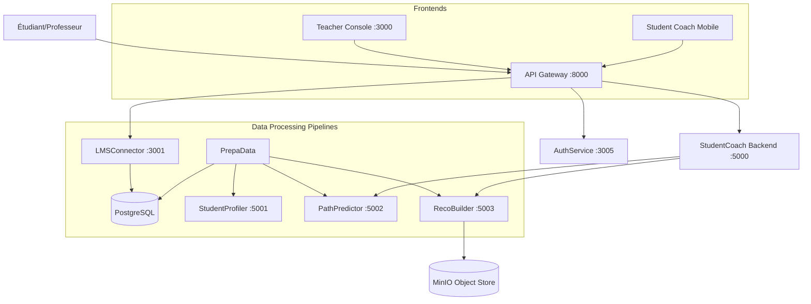
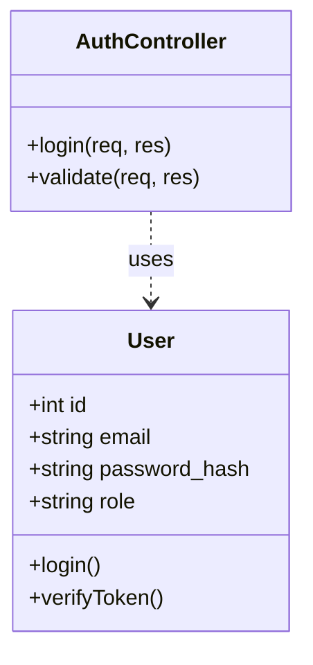
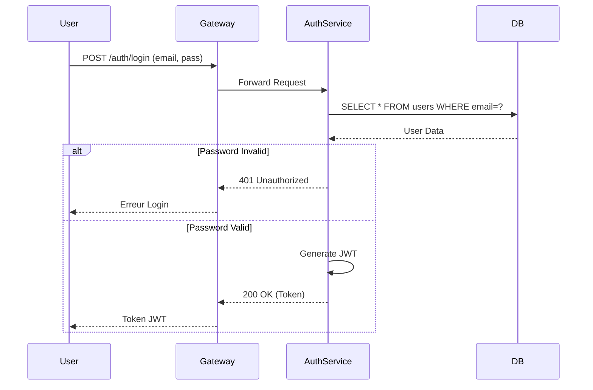
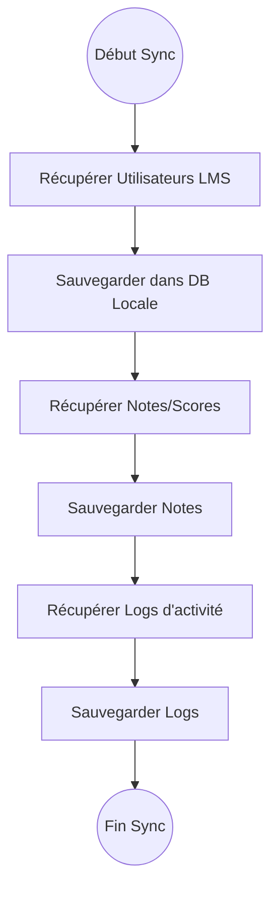
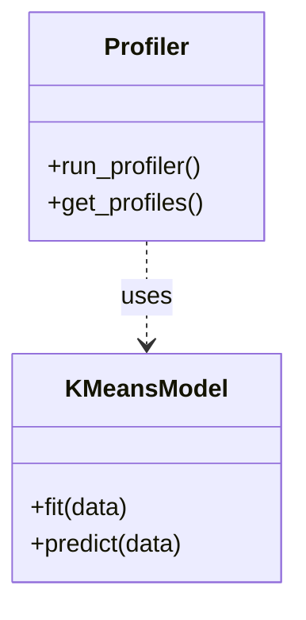
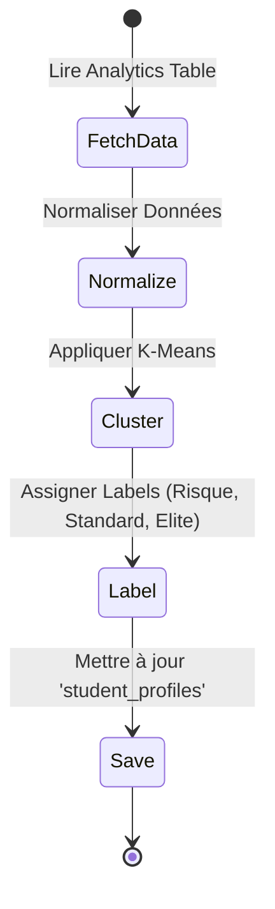
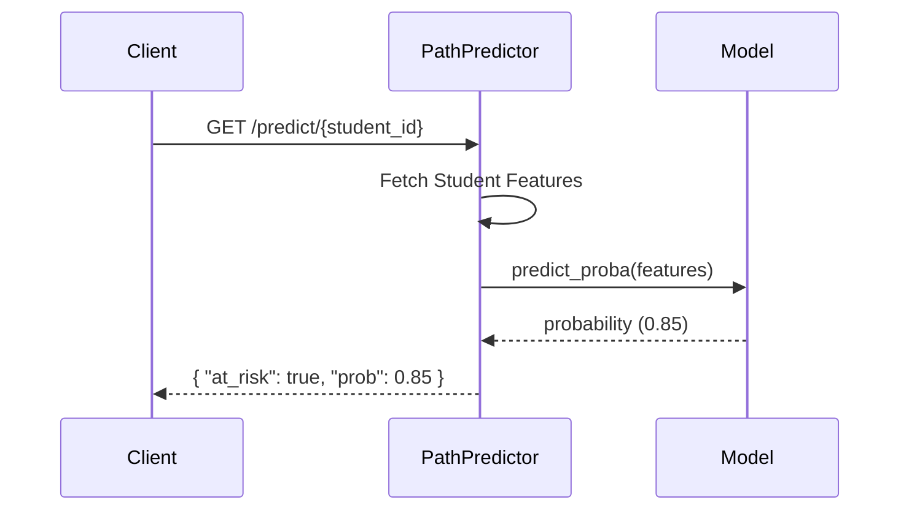
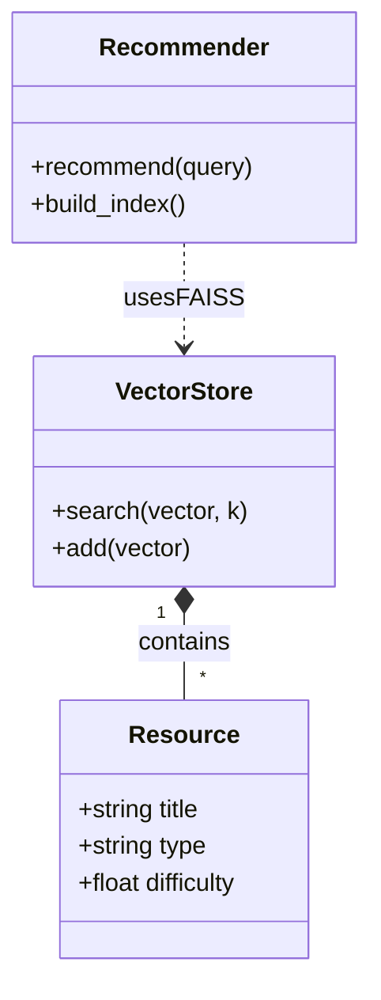
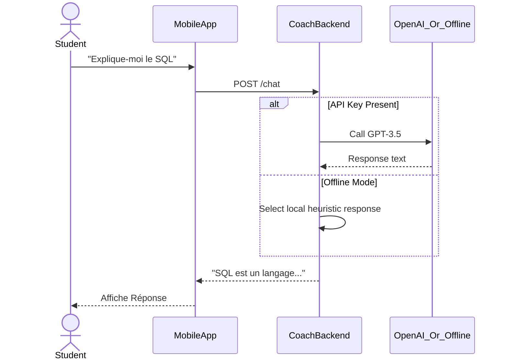
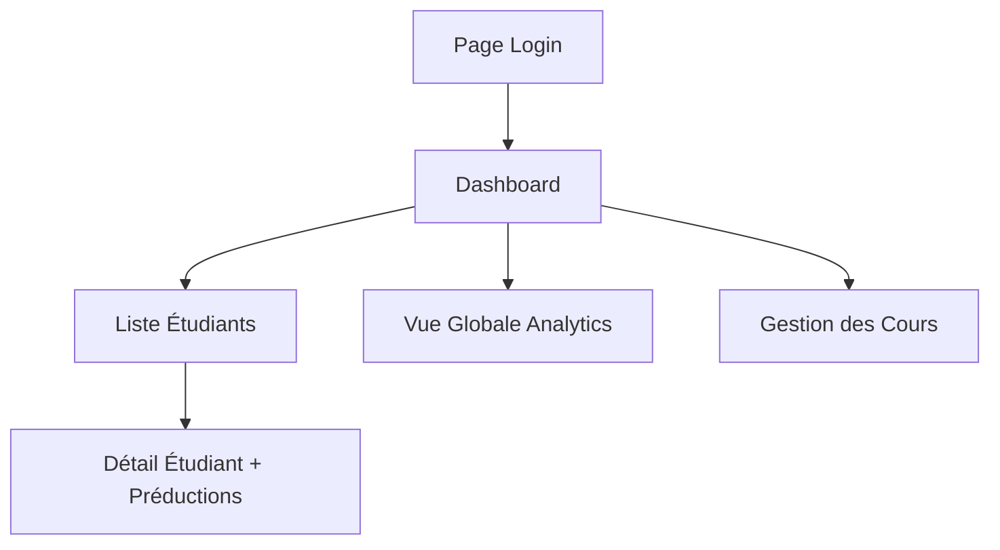

# Conception et Architecture EduPath-MS

Ce document regroupe les éléments de conception demandés : Architecture globale, Diagrammes BPMN des processus métiers, et conception détaillée (Classes, Cas d'utilisation) pour chaque microservice.

## 1. Architecture Microservices

### Vue d'ensemble
Le système EduPath-MS est composé de services autonomes communiquant principalement via API REST (Synchrone) et partageant des bases de données PostgreSQL et un stockage MinIO.



### Tableau Récapitulatif

| Microservice | Rôle | Technologies | Base de Données | Communication |
| :--- | :--- | :--- | :--- | :--- |
| **AuthService** | Gestion de l'authentification (Login, JWT) | Node.js (Express) | PostgreSQL | REST (Sync) |
| **APIGateway** | Point d'entrée unique, routage, validation JWT | Node.js (Express), Http-Proxy | - | REST (Sync) |
| **LMSConnector** | Synchronisation des données depuis LMS externes (Moodle) | Node.js (Express) | PostgreSQL | REST (Sync) |
| **PrepaData** | ETL : Extraction, Transformation, Chargement des logs | Python (Pandas) | PostgreSQL | Script/Batch |
| **StudentProfiler** | Clustering des étudiants (K-Means) | Python (Flask, Scikit-learn) | PostgreSQL | REST (Sync) |
| **PathPredictor** | Prédiction de risques d'échec (XGBoost) | Python (Flask, XGBoost) | - (Lit PostgreSQL) | REST (Sync) |
| **RecoBuilder** | Recommandation de contenu (RAG/Vector Search) | Python (Flask, FAISS) | PostgreSQL / MinIO | REST (Sync) |
| **StudentCoach** | Chatbot & Interaction Élève | Python (FastAPI), Flutter | - | REST (Sync) |
| **TeacherConsole** | Dashboard Professeur | React (CRA) | - | REST (Sync) |

---

## 2. Conception par Microservice

### 2.1 AuthService

**Rôle** : Vérifie les identifiants et délivre des tokens JWT.

#### Cas d'Utilisation
*   **Acteur** : Tout utilisateur (Étudiant, Professeur)
*   **Cas** : "Se connecter", "Se déconnecter", "Valider Token".

#### Diagramme de Classes


#### Diagramme BPMN : Processus d'Authentification


---

### 2.2 LMSConnector

**Rôle** : Récupère les cours, notes et logs depuis le LMS (simulé) et les stocke en local.

#### Diagramme BPMN : Processus de Synchronisation


---

### 2.3 PrepaData (ETL)

**Rôle** : Nettoie les données brutes pour l'analyse.

#### BPMN / Flow de Données
```mermaid
graph LR
    Raw[Données Brutes (Logs, Notes)] -->|Extract| Clean[Nettoyage & Agrégation]
    Clean -->|Transform| Feat[Calcul Indicateurs (Temps passé, Moyenne)]
    Feat -->|Load| AnalyticsTable[Table 'student_analytics']
```

---

### 2.4 StudentProfiler

**Rôle** : Analyse les comportements pour segmenter les étudiants.

#### Diagramme de Classes


#### BPMN : Processus de Profilage


---

### 2.5 PathPredictor

**Rôle** : Estime la probabilité d'échec d'un étudiant.

#### Cas d'Utilisation
*   **Acteur** : Système (Automatique) ou Professeur (Consultation)
*   **Cas** : "Prédire Risque Échec"

#### BPMN : Prédiction


---

### 2.6 RecoBuilder

**Rôle** : Recommande des ressources pédagogiques adaptées.

#### Diagramme de Classes


---

### 2.7 StudentCoach (Backend & Mobile)

**Rôle** : Compagnon d'apprentissage interactif (Chatbot).

#### Cas d'Utilisation
*   **Acteur** : Étudiant
*   **Cas** : "Poser une question", "Demander un Quiz", "Voir sa progression".

#### BPMN : Interaction Chat


---

### 2.8 TeacherConsole

**Rôle** : Tableau de bord pour la supervision.

#### Diagramme de Navigation (Conception UI)

