# PlantUML Diagrams

This document contains PlantUML code for Use Case and Class diagrams for each microservice in the EduPath-MS platform. You can render these using any PlantUML viewer (like PlanUML Editor, VS Code extension, or online server).

## 1. Authentication Service (AuthService)

**Use Case Diagram:**
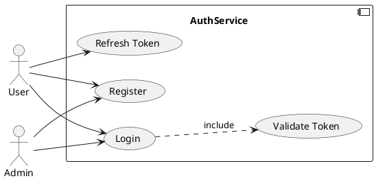

**Class Diagram:**
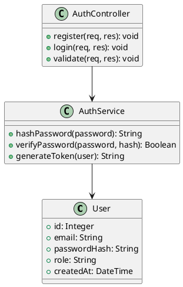

## 2. LMS Connector Service

**Use Case Diagram:**
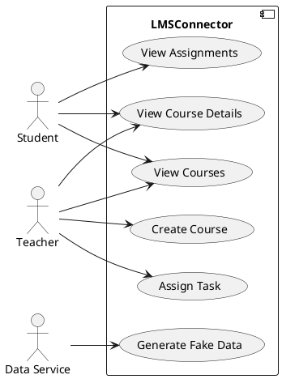

**Class Diagram:**
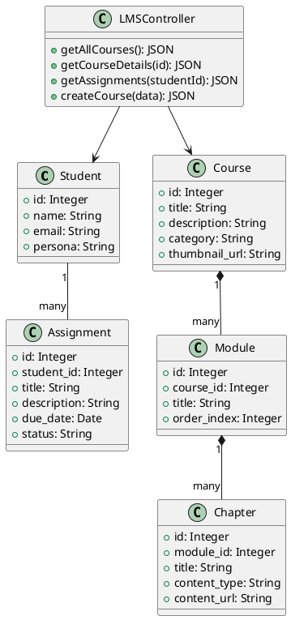

## 3. Preparation Data Service (PrepaData)

**Use Case Diagram:**
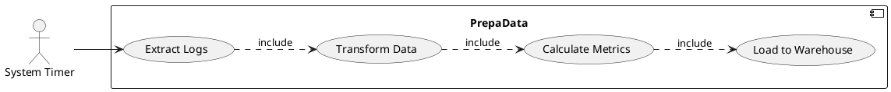

**Class Diagram:**
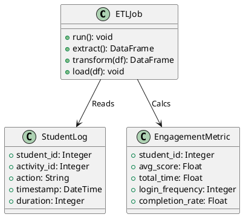

## 4. Student Profiler Service

**Use Case Diagram:**
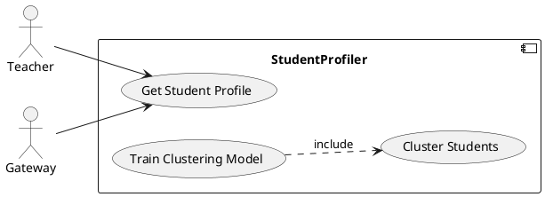

**Class Diagram:**
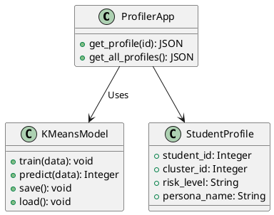

## 5. Path Predictor Service

**Use Case Diagram:**
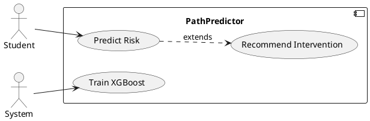

**Class Diagram:**
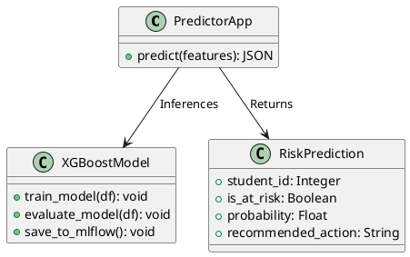

## 6. Recommendation Builder (RecoBuilder)

**Use Case Diagram:**
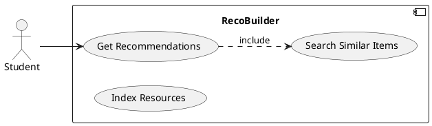

**Class Diagram:**
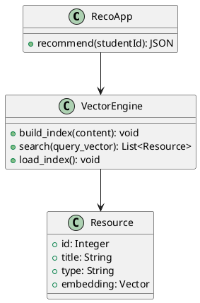

## 7. Student Coach Service

**Use Case Diagram:**
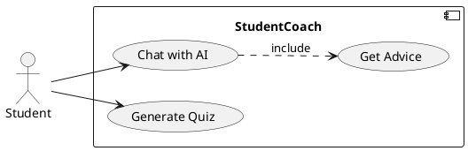

**Class Diagram:**
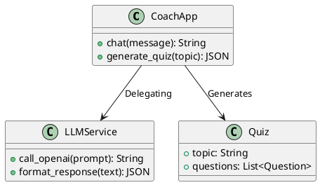

## 8. Teacher Console

**Use Case Diagram:**
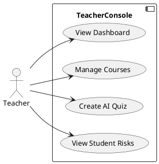

## 9. API Gateway

**Use Case Diagram:**
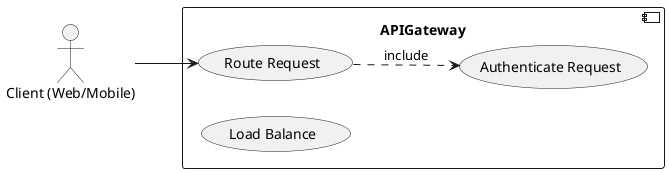
